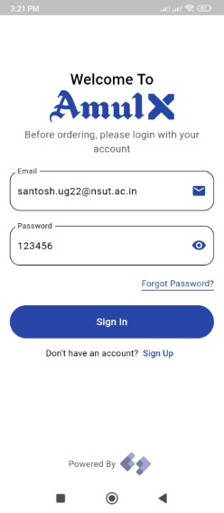
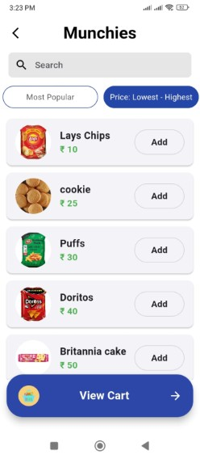
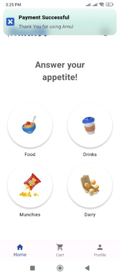

# Project Description

**Problem:** **Overwhelming demand** at the **Amul shop on the NSUT campus** caused **25–30-minute wait times**, resulting in **missed classes** and **frustration**.

**Solution:** **Developed an app for pre-ordering food**, enabling **quick pick-up without standing in queues**.

## 🔧 Features Implemented

- **Secure user authentication** for **NSUT students and faculty** using **college email IDs**
- **Add items to cart**, **place orders**, and **track order status**
- **Integrated payment gateway** for **quick and easy transactions**
- **Real-time notifications** to keep users updated on **order status**

## Tech Stack

**FrontEnd:** Flutter, Bloc, Getx.
**BackEnd:** Firebase.

## 📸 App Screenshots

<table>
  <tr>
    <td> 📠Signup</td>
    <td> 🔠Login</td>
    <td> 🠠Dashboard</td>
  </tr>
  <tr>
    <td> 🕳️ Empty Cart</td>
    <td> 🔠Menu Items</td>
    <td> 🛒 Cart</td>
  </tr>
  <tr>
    <td> 💳 Checkout</td>
    <td> ✅ Payment Success</td>
    <td> 📜 Order History</td>
  </tr>
</table>

